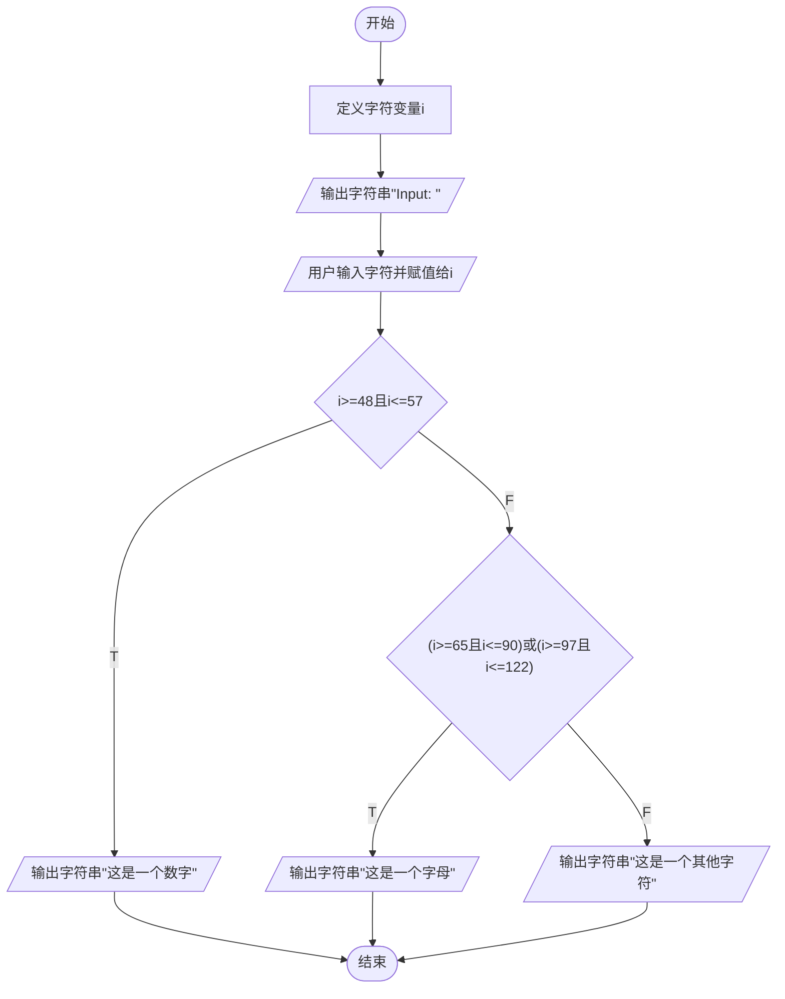
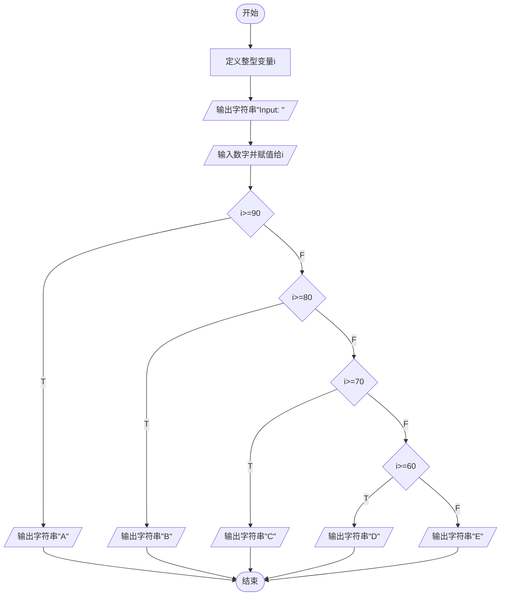

## 一、实验目的

1. 熟练掌握顺序结构程序设计；

2. 掌握标准输入输出函数的基本用法；

3. 熟练掌握基本运算符与基本数据类型；

4. 练习调试与修改程序。

## 二、实验环境

操作系统：macOS

开发工具：Microsoft Visual Studio Code

## 三、实验内容

【题目 1】从键盘输入一个字符，判断它是数字、字母还是其它字符。

比如（黄底红字为用户输入内容）：

Input: <font color=Red style=background:yellow> a </font>

这是一个字母

又比如（黄底红字为用户输入内容）：

Input: <font color=Red style=background:yellow>#</font>

这是一个其它字符


【题目 2】从键盘输入三个整数，输出其中最大的数。

比如（黄底红字为用户输入内容）：

Input: <font color=Red style=background:yellow>12 33 11</font>

最大的数是：33

 

【题目 3】从键盘输入一个百分制成绩，将其转换成相应的成绩等级 A（90 分以上）、B （80-89 分）、C（70-79 分）、D（60-69 分）、E（60 分以下）并输出。

比如（黄底红字为用户输入内容）：

Input: <font color=Red style=background:yellow>99</font>

Level: A

 

【题目 4】编写一个程序，提示用户输入一个整数表示每天工作的小时数，然后打印每个

月的工资总额、个税和净收入。做如下假设（与实际法律不符）： 

（1） 基本工资 = 50 元/小时

（2） 加班（每天超过 8 小时的部分） = 1.5 倍的时间

（3） 每个月 = 21.5 天 

（4） 税率：前 800 元免税，800-5000 元为 20%，余下的为 30%

比如（黄底红字为用户输入内容）：

Everyday working hours: <font color=Red style=background:yellow>6</font>

Salary: 6450.00

Tax: 1275.00

Income: 5175.00

又比如（黄底红字为用户输入内容）：

Everyday working hours: <font color=Red style=background:yellow>10</font>

Salary: 11825.00

Tax: 2887.50

Income: 8937.50

 

【题目 5】从键盘输入不多于 5 位的正整数，要求：

（1） 求出它是几位数；

<font color=Red>（2） （选做）分别输出每一位数字；</font>

<font color=Red>（3） （选做）按逆序输出各位数字，例如原数为 321，应输出 123。</font>

比如（黄底红字为用户输入内容）：

Input: <font color=Red style=background:yellow>3425</font>

位数是：4 

第 1 个数是：3 

第 2 个数是：4 

第 3 个数是：2 

第 4 个数是：5 

第 5 个数是：no

逆序数是：5243


## 四、实验过程

### 4.1 题目1

首先，确定程序流程图，如图 1 所示。



<center>图 1 题目 1 流程图</center>


根据题目要求，编写程序如图表1所示：

```c
#include<stdio.h>
int main(){
    char i;  
    printf("Input: ");  
    scanf("%c",&i);  
    if(i>=48&&i<=57){  
        printf("这是一个数字"); 
    }
    else if((i>=65&&i<=90)||(i<=97&&i<=122)){
        printf("这是一个字母"); 
    }
    else{ 
        printf("这是一个其他字符"); 
    }
}
```

<center>表 1 题目 1 程序</center>

程序运行结果如图 2 所示


<center>图 2 题目 1 运行结果</center>

### 4.2题目2

首先，确定程序流程图，如图 3 所示。


<center>图 3 题目 2 流程图</center>

根据题目要求，编写程序如图表 2 所示：

```c
#include<stdio.h>
int main(){
    int a,i,b=-255; 
    printf("Input: ");
    
    for(a=0;a<3;a++){
        scanf("%d",&i);
        if(i>b) b=i;
    }
    printf("最大的数是：%d",b);
}
```

<center>表 2 题目 2 程序</center>

程序运行结果如图 4 所示


<center>图 4 题目 2 运行结果</center>


### 4.3题目3

首先，确定程序流程图，如图 5 所示。



<center>图 5 题目 3 流程图</center>

根据题目要求，编写程序如图表 3 所示：

```c
#include<stdio.h>
int main(){
    int i;
    printf("Input: ");
    scanf("%d",&i);
    if(i>=90) printf("A");
    else if(i>=80) printf("B");
    else if(i>=70) printf("C");
    else if(i>=60) printf("D");
    else printf("E");
}
```

<center>表 3 题目 3 程序</center>

程序运行结果如图 6 所示


<center>图 6 题目 3 运行结果</center>


### 4.4题目4

首先，确定程序流程图，如图 7 所示。

```mermaid
flowchart TD
开始([开始])-->定义整形变量h\n定义双浮点型变量salary,tax,income-->tax=0-->1[/"输出字符串#quot;Everyday workingh hours: #quot;"/]-->2[/"输入数字并赋值给h"/]-->3{h>8}--T-->4["h+=(h-8)*0.5"]-->5[salary=h*21.5*50]
3--F-->5
5-->6{salary>=800且\nsalary<=5000}--T-->7["tax+=(salary-800)*0.2"]-->9[income=salary-tax]
6--F-->8["tax+=(5000-800)*0.2\ntax+=(salary-5000)*0.3"]-->9
9-->10[/"输出字符串Salary: \n输出保留两位的salary变量的值"/]-->11[/"输出字符串Tax: \n输出保留两位的tax变量的值"/]-->12[/"输出字符串Income: \n输出保留两位的income变量的值"/]-->结束([结束])
```

<center>图 7 题目 4 流程图</center>

根据题目要求，编写程序如图表 4 所示：

```c
#include<stdio.h>
int main(){
    int h;
    double salary,tax=0,income;
    printf("Everyday working hours: ");
    scanf("%d",&h);
    if(h>8){h+=(h-8)*0.5;}
    salary=h*21.5*50; 
    if(salary>=800&&salary<=5000){
        tax+=(salary-800)*0.2;
    }
    else if(salary>5000){
        tax+=(5000-800)*0.2;
        tax+=(salary-5000)*0.3;
    }
    income=salary-tax;
    printf("Salary: %.2lf\n",salary);
    printf("Tax: %.2lf\n",tax);
    printf("Income: %.2lf\n",income);

}
```

<center>表 4 题目 4 程序</center>

程序运行结果如图 8 所示


<center>图 8 题目 4 运行结果</center>

### 4.5题目5

首先，确定程序流程图，如图 9 所示。

```mermaid
flowchart TD
subgraph 位数
开始([开始])-->定义整形变量n,tmp,count,i,cn,cy-->tmp=1\ncount=0\ncn=0\ncy=1-->定义长度为5的整形数组arr\n并初始化其值为-1-->2[/"输出字符串#quot;Input: #quot;"/]-->3[/"输入数字并赋值给n"/]-->4["tmp=n%10"]-->while{tmp>0}
while--F-->6[/"输出字符串#quot;位数是：#quot;\n输出count变量的值"/]-->7
while--T-->5["arr[count]=tmp\ncount++\nn/=10\ntmp=n%10"]-->while
end

subgraph 逐位输出
7[i=4]-->8{i>=0}--T-->9{"arr[i]>0"}--T-->10[/"输出字符串#quot;第%d个数是：%d \ n#quot;\n其中%d填充cy和arr[i]变量的值"/]-->cy++-->11[i--]-->8
9--F-->cn++-->11
8--F-->12{cn>0}--T-->13[/"输出字符串#quot;第%d个数是：%d \ n#quot;\n其中%d填充6-cn的值"/]-->14[cn--]-->12
end

subgraph 逆序数
12--F-->14[/"输出字符串#quot;逆序数是：#quot;"/]-->i=0-->15{i<count}--T-->16[/"输出整型变量arr[i]的值"/]-->15
15--F-->结束([结束])
end
```

<center>图 9 题目 5 流程图</center>

根据题目要求，编写程序如图表 5 所示：

```c
#include<stdio.h>
int main(){
    int n,tmp=1,count=0,i,cn=0,cy=1;
    int arr[5]={-1};
    printf("Input: ");
    scanf("%d",&n);
    tmp=n%10;
    while(tmp)
    {  
        arr[count]=tmp;
        count++;
        n/=10;
        tmp=n%10;
    }
    printf("位数是：%d\n",count);
    for(i=4;i>=0;i--){
        if(arr[i]>0){
            printf("第%d个数是：%d\n",cy++,arr[i]);
        }
        else{cn++;}
    }
    while(cn){
        printf("第%d个数是：no\n",6-cn);
        cn--;
    }
    printf("逆序数是：");
    for(i=0;i<count;i++){
        printf("%d",arr[i]);
    }
    printf("\n");
}
```

<center>表 5 题目 5 程序</center>

程序运行结果如图 10 所示


<center>图 10 题目 5 运行结果</center>

## 五、心得体会

### 5.1 实验收获

我对C语言基本语句更加熟悉。对编写算法和调试程序的工作更加熟练。

### 5.2 遇到的问题

- 由于Word文档排版复杂，逐个图形绘制流程图比较麻烦。我在网上学习了Markdown语法和Mermaid绘图，大大提高了工作效率。

- 我学会了制作文档模板，以供后续的报告使用，减少了重复工作提高了效率。


